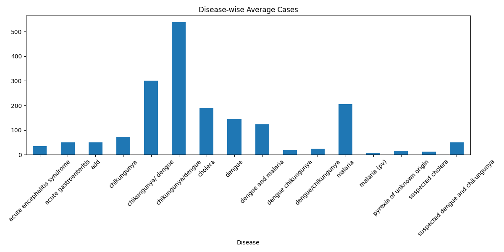
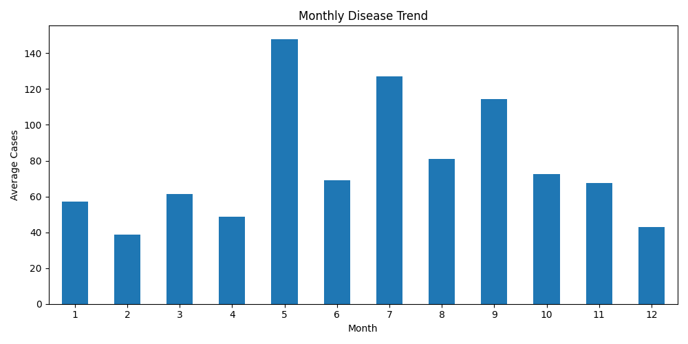
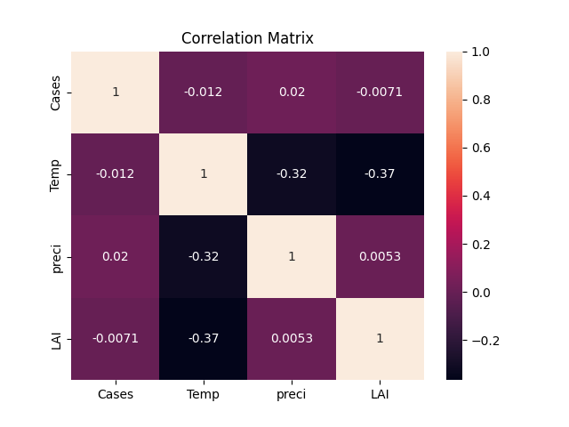
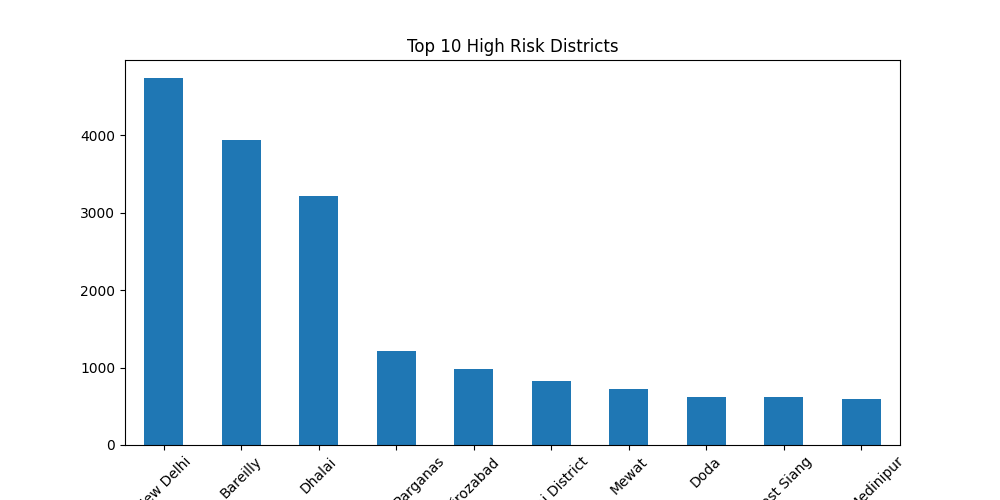
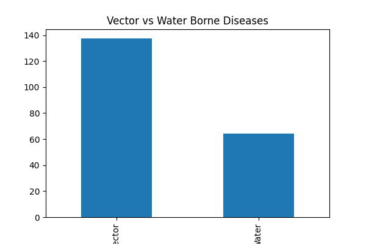

[README.md](https://github.com/user-attachments/files/23306117/README.md)
# Analyzing the Impact of Climate on Epidemic Trends in India

### Identifying High-Risk Epidemic Zones Using Data-Driven Risk Scoring and Clustering

---

## Introduction

Epidemic outbreaks in India—especially **vector-borne and waterborne diseases** like dengue, malaria, and chikungunya—show strong correlations with **climatic factors** such as temperature, humidity, and rainfall.  

This project develops a **data-driven, non-GIS approach** to identify **high-risk epidemic zones** across Indian districts using **risk score computation**, **clustering algorithms**, and **machine learning validation**.

By leveraging the **EpiClim dataset**, which provides district-wise weekly epidemic and climate data, the model detects spatial-temporal patterns and classifies each district into high, moderate, or low epidemic risk zones. These insights can help **public health authorities** allocate resources efficiently and predict outbreaks early.

---

##  Objectives

- **Data Acquisition & Preprocessing:**  
  Collect, clean, and preprocess district-level epidemic and climate datasets from public sources.

- **Risk Score Computation:**  
  Create a composite risk index using epidemic incidence, rainfall, temperature, and humidity.

- **Clustering for Risk Zone Identification:**  
  Apply **K-Means** and **DBSCAN** algorithms to group districts with similar epidemic characteristics.

- **Machine Learning Validation:**  
  Use **Random Forest** and **Logistic Regression** to classify risk levels and validate clustering accuracy.

- **Visualization & Insights:**  
  Generate **heatmaps**, **time-series trends**, and **risk comparison charts** to support public health planning.

---

##  Workflow

1. **Data Collection & Preprocessing**  
   - Download datasets from **EpiClim**, **IMD**, and **IDSP**.  
   - Handle missing values and normalize climatic variables.  
   - Perform **Exploratory Data Analysis (EDA)** for trend identification.

2. **Exploratory Data Analysis (EDA) & Insights (Added Work)**  
   - Performed detailed analysis using cleaned dataset  
   - Observed seasonal outbreak patterns (monsoon peaks)  
   - Identified dominant diseases (Dengue, Malaria, Chikungunya)  
   - Analyzed correlation between temperature, rainfall, and cases  
   - Highlighted high-risk districts based on average cases  
   - Generated visual outputs saved as `.png` for reporting and presentation

3. **Risk Score Computation**  
   - Develop a weighted formula linking epidemic rates to climatic variables.  
   - Rank and categorize districts as **High**, **Moderate**, or **Low Risk**.

4. **Clustering for Zone Detection**  
   - Apply **K-Means** for similarity grouping.  
   - Use **DBSCAN** to detect **outbreak hotspots**.  
   - Compare results with computed risk scores.

5. **Machine Learning Classification**  
   - Train and test **Random Forest** / **Logistic Regression** models.  
   - Evaluate performance using **accuracy**, **precision**, **recall**, and **F1-score**.
   
---

## Results & Analysis

### 🔹 Exploratory Data Analysis (EDA)
- Disease-wise analysis  
- Monthly trends  
- Correlation between climate and disease  
- High-risk district identification  

### 🔹 Disease-wise Analysis

### 🔹 Monthly Trend

### 🔹 Correlation Heatmap

### 🔹 High Risk Districts

### 🔹 Water vs Vector Analysis

### 🔹 Clustering & Machine Learning 
- K-Means clustering for grouping districts  
- DBSCAN for hotspot detection  
- Random Forest & Logistic Regression for classification  
- Heatmaps and cluster visualizations generated  

 These models help identify epidemic zones and validate risk predictions.

---

##  Expected Outcomes

- Identification of **high-risk epidemic zones** across India.  
- Predictive models for **epidemic severity forecasting**.  
- **Visual analytics dashboards** highlighting regional epidemic patterns.  
- Actionable insights for **public health resource allocation**.

---

##  Tools & Technologies

| Category | Tools / Libraries |
|-----------|-------------------|
| **Programming Language** | Python |
| **Libraries** | Pandas, NumPy, Scikit-learn, Matplotlib, Seaborn |
| **Development Environment** | Jupyter Notebook / Google Colab |
| **Optional Visualization** | Power BI / Tableau |
| **Datasets** | EpiClim Dataset (arXiv), IMD Open Data, IDSP Portal |

---

##  Sample Visuals
- **Heatmaps** — Epidemic intensity across regions.  
- **Trend Analysis** — Seasonal and yearly epidemic trends.  
- **Cluster Maps** — Data-driven grouping of high-risk districts.  

---

## 📁 Dataset References

- **EpiClim Dataset** – District-wise weekly epidemic and climate data  
- **IMD Open Data** – Rainfall, humidity, and temperature datasets  
- **IDSP Portal** – Government epidemic surveillance data  

---

##  Contributors
- **Project Lead:** *Sunidhi*  
- **Domain:** Data Science & Epidemiology  
- **Focus:** Climate-driven epidemic trend analysis  

---

##  Future Scope

- Integration with **real-time climate monitoring systems**  
- Development of an **interactive epidemic risk dashboard**  
- Incorporation of **deep learning models** for temporal prediction  

---

##  License

This project is released under the **MIT License** – you’re free to use, modify, and share it with attribution.
